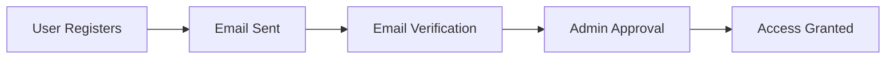

# SUST-CSE Frontend

> **Modern, Responsive Next.js Application for the Department of Computer Science and Engineering, SUST.**

A high-performance single-page application built with Next.js 16, Redux Toolkit, and Tailwind CSS, providing an intuitive interface for students, faculty, alumni, and administrators.

---

## Table of Contents

- [Tech Stack](#-tech-stack)
- [Features](#-features)
- [Getting Started](#-getting-started)
- [Environment Variables](#-environment-variables)
- [Project Structure](#-project-structure)
- [Key Features](#-key-features)
- [Routing & Navigation](#-routing--navigation)
- [State Management](#-state-management)
- [API Integration](#-api-integration)
- [Authentication Flow](#-authentication-flow)
- [UI Components](#-ui-components)
- [Deployment](#-deployment)
- [Best Practices](#-best-practices)

---

## Tech Stack

| Category | Technologies |
|----------|-------------|
| **Framework** | Next.js 16.1 (App Router) |
| **Language** | TypeScript 5 |
| **UI Library** | React 19.2 |
| **Styling** | Tailwind CSS 4, Material UI 7.3 |
| **State Management** | Redux Toolkit 2.11, RTK Query |
| **Forms** | React Hook Form 7.71, Zod 4.3 |
| **Animations** | GSAP 3.14 |
| **HTTP Client** | Axios 1.13 |
| **Rich Text** | React Quill (New) |
| **Icons** | Lucide React |
| **Utilities** | date-fns, clsx, tailwind-merge |
| **Authentication** | JWT (jwt-decode, js-cookie) |
| **Notifications** | React Hot Toast |

---

## Features

### User Interfaces

- **🏠 Public Homepage**
  - Dynamic banner carousel
  - About the department
  - Research areas showcase
  - Recent achievements
  - Department services
  - Responsive design with smooth animations

- **Student Dashboard**
  - Personal profile overview
  - Finance management (conditional access)
  - Application submissions (conditional access)
  - Work assignments
  - Blog authoring

- **Teacher Dashboard**
  - Faculty profile management
  - Course management
  - Student oversight

- **Admin Dashboard**
  - User approval system
  - Content management (CMS)
  - Homepage customization
  - Notices & events management
  - Society management
  - Finance oversight
  - Blog moderation

### Core Features

- **Authentication & Authorization**
  - JWT-based authentication
  - Email verification
  - Password reset functionality
  - Role-based access control (RBAC)
  - Protected routes

- **Content Management**
  - Blog creation with rich text editor
  - Event management with categories
  - Notice board
  - Homepage content customization
  - Image uploads with preview

- **Financial Transparency**
  - Public income/expense ledger
  - Proof document uploads (images/PDFs)
  - Category-based filtering
  - Real-time updates

- **Academic Resources**
  - Faculty directory
  - Alumni network
  - Student profiles
  - Batch and session filtering

- **Application System**
  - Application submission
  - Status tracking
  - Admin review workflow

- **Society Management**
  - Hierarchical member structure
  - Work assignment system
  - Task tracking
  - Progress monitoring

---

## Getting Started

### Prerequisites

- **Node.js** (v18 or higher)
- **npm** or **yarn**
- **Backend API** (running locally or deployed)

### Installation

1. **Navigate to Frontend directory**
   ```bash
   cd Frontend
   ```

2. **Install dependencies**
   ```bash
   npm install
   ```

3. **Set up environment variables**
   ```bash
   cp .env.example .env
   ```
   Edit `.env` with your backend API URL:
   ```bash
   NEXT_PUBLIC_API_URL=http://localhost:5000/api
   # OR for production:
   # NEXT_PUBLIC_API_URL=https://your-backend.vercel.app/api
   ```

4. **Start development server**
   ```bash
   npm run dev
   ```

5. **Open in browser**
   ```
   http://localhost:3000
   ```

---

## Environment Variables

Create a `.env` file in the Frontend directory:

```bash
# Required: Backend API Base URL
NEXT_PUBLIC_API_URL=http://localhost:5000/api

# Production Example:
# NEXT_PUBLIC_API_URL=https://backend-production-url.vercel.app/api
```

> **Note:** All environment variables prefixed with `NEXT_PUBLIC_` are exposed to the browser.

---

## Project Structure

```
Frontend/
├── public/                      # Static assets
│   ├── images/
│   ├── icons/
│   └── ...
│
├── src/
│   ├── app/                     # Next.js App Router pages
│   │   ├── layout.tsx           # Root layout with providers
│   │   ├── page.tsx             # Homepage
│   │   │
│   │   ├── about/               # About page
│   │   ├── academic/            # Academic resources
│   │   ├── achievements/        # Department achievements
│   │   ├── alumni/              # Alumni directory
│   │   ├── applications/        # Application system
│   │   │   └── submit/          # Submit application
│   │   ├── blogs/               # Blog listing & details
│   │   ├── events/              # Events listing
│   │   ├── faculty/             # Faculty directory
│   │   ├── finance/             # Financial transparency
│   │   ├── notices/             # Notice board
│   │   ├── profile/[id]/        # User profiles
│   │   ├── projects/            # Research projects
│   │   ├── research/            # Research areas
│   │   ├── services/            # Department services
│   │   ├── societies/           # Society pages
│   │   ├── students/            # Student directory
│   │   │
│   │   ├── login/               # Login page
│   │   ├── register/            # Registration page
│   │   ├── verify/              # Email verification
│   │   ├── forgot-password/     # Password reset request
│   │   ├── reset-password/      # Password reset form
│   │   │
│   │   ├── dashboard/           # User dashboards
│   │   │   ├── student/         # Student dashboard
│   │   │   └── teacher/         # Teacher dashboard
│   │   │
│   │   └── admin/               # Admin panel
│   │       └── dashboard/       # Admin dashboard
│   │           ├── users/       # User management
│   │           ├── blogs/       # Blog management
│   │           ├── events/      # Event management
│   │           ├── notices/     # Notice management
│   │           ├── homepage/    # Homepage CMS
│   │           ├── societies/   # Society management
│   │           └── ...
│   │
│   ├── components/              # Reusable UI components
│   │   ├── common/              # Shared components
│   │   │   ├── Navbar.tsx
│   │   │   ├── Footer.tsx
│   │   │   ├── LoadingSpinner.tsx
│   │   │   └── ProtectedRoute.tsx
│   │   ├── dashboard/           # Dashboard-specific components
│   │   ├── home/                # Homepage sections
│   │   └── admin/               # Admin panel components
│   │
│   ├── features/                # Redux slices & API endpoints
│   │   ├── auth/                # Authentication
│   │   │   ├── authSlice.ts     # Auth state management
│   │   │   └── authApi.ts       # Auth API endpoints
│   │   ├── user/
│   │   ├── blog/
│   │   ├── event/
│   │   ├── finance/
│   │   ├── content/
│   │   ├── alumni/
│   │   ├── application/
│   │   ├── society/
│   │   ├── payment/
│   │   ├── product/
│   │   └── work-assignment/
│   │
│   ├── store/                   # Redux store configuration
│   │   ├── index.ts             # Store setup
│   │   └── apiSlice.ts          # RTK Query base API
│   │
│   ├── hooks/                   # Custom React hooks
│   │   └── useAuth.ts           # Authentication hook
│   │
│   ├── utils/                   # Utility functions
│   │   ├── api.ts               # Axios instance
│   │   └── helpers.ts           # Helper functions
│   │
│   └── styles/                  # Global styles
│       └── globals.css          # Tailwind imports & custom CSS
│
├── .env                         # Environment variables (not in git)
├── .env.example                 # Environment template
├── .gitignore
├── next.config.ts               # Next.js configuration
├── tailwind.config.ts           # Tailwind CSS configuration
├── postcss.config.mjs           # PostCSS configuration
├── tsconfig.json                # TypeScript configuration
├── package.json
└── README.md
```

---

## Key Features

### 1. Authentication System

The app implements a complete authentication flow:

```typescript
// Login
POST /api/auth/login
→ Stores JWT in cookies
→ Updates Redux auth state
→ Redirects to dashboard

// Auto-login on page load
useEffect(() => {
  const token = Cookies.get('token');
  if (token) {
    dispatch(setCredentials({ token, user }));
  }
}, []);
```

**Protected Routes:**
```typescript
// components/common/ProtectedRoute.tsx
export function ProtectedRoute({ children, allowedRoles }) {
  const { user, isAuthenticated } = useAuth();
  
  if (!isAuthenticated) {
    return <Navigate to="/login" />;
  }
  
  if (allowedRoles && !allowedRoles.includes(user.role)) {
    return <Navigate to="/unauthorized" />;
  }
  
  return children;
}
```

### 2. Dashboard System

**Role-Based Dashboards:**

| Role | Dashboard Route | Features |
|------|----------------|----------|
| Student | `/dashboard/student` | Profile, Finance*, Applications*, Work Assignments |
| Teacher | `/dashboard/teacher` | Profile, Course Management, Student Oversight |
| Admin | `/admin/dashboard` | Full System Control, CMS, User Management |

*Conditional access based on permissions

### 3. Content Management

**Admin CMS Features:**
- Homepage banner management (image upload, reordering)
- About section editor
- Research areas CRUD
- Services management
- Achievements showcase
- Notice board
- Event calendar

### 4. Finance Module

**Public Financial Transparency:**
```typescript
// Public ledger accessible to all users
GET /api/finance
→ Returns: Income/Expense records with proof documents
→ Filters: type, category, dateRange
```

**Features:**
- Category-based organization
- Image/PDF proof uploads
- Real-time balance calculation
- Admin/permitted user entry creation

### 5. Rich Text Editor

**Blog & Content Creation:**
- React Quill integration
- Markdown support
- Image embedding
- Code syntax highlighting
- Draft saving

---

## Routing & Navigation

### Public Routes

| Route | Description |
|-------|-------------|
| `/` | Homepage |
| `/about` | About the department |
| `/faculty` | Faculty directory |
| `/students` | Student directory |
| `/alumni` | Alumni network |
| `/blogs` | Blog listing |
| `/blogs/[id]` | Blog details |
| `/events` | Events calendar |
| `/notices` | Notice board |
| `/finance` | Financial transparency |
| `/societies` | Society pages |
| `/research` | Research areas |
| `/achievements` | Department achievements |
| `/services` | Department services |
| `/projects` | Research projects |

### Authentication Routes

| Route | Description |
|-------|-------------|
| `/login` | User login |
| `/register` | New user registration |
| `/verify` | Email verification |
| `/forgot-password` | Password reset request |
| `/reset-password` | Password reset form |

### Protected Routes (Authenticated)

| Route | Roles | Description |
|-------|-------|-------------|
| `/dashboard/student` | Student | Student dashboard |
| `/dashboard/teacher` | Teacher | Teacher dashboard |
| `/profile/[id]` | All | User profile |
| `/applications/submit` | Student | Submit application |

### Admin Routes

| Route | Description |
|-------|-------------|
| `/admin/dashboard` | Admin overview |
| `/admin/dashboard/users` | User management |
| `/admin/dashboard/blogs` | Blog moderation |
| `/admin/dashboard/events` | Event management |
| `/admin/dashboard/notices` | Notice management |
| `/admin/dashboard/homepage` | Homepage CMS |
| `/admin/dashboard/societies` | Society management |

---

## State Management

### Redux Store Structure

```typescript
{
  auth: {
    user: User | null,
    token: string | null,
    isAuthenticated: boolean
  },
  api: {
    // RTK Query cache
    queries: { ... },
    mutations: { ... }
  }
}
```

### RTK Query API Slices

Each feature module has its own API slice:

```typescript
// features/blog/blogApi.ts
export const blogApi = apiSlice.injectEndpoints({
  endpoints: (builder) => ({
    getBlogs: builder.query({ ... }),
    getBlogById: builder.query({ ... }),
    createBlog: builder.mutation({ ... }),
    updateBlog: builder.mutation({ ... }),
    deleteBlog: builder.mutation({ ... })
  })
});
```

**Usage in Components:**
```typescript
import { useGetBlogsQuery, useCreateBlogMutation } from '@/features/blog/blogApi';

function BlogList() {
  const { data: blogs, isLoading, error } = useGetBlogsQuery();
  const [createBlog, { isLoading: isCreating }] = useCreateBlogMutation();
  
  // Component logic...
}
```

---

## API Integration

### Base API Configuration

```typescript
// store/apiSlice.ts
import { createApi, fetchBaseQuery } from '@reduxjs/toolkit/query/react';
import Cookies from 'js-cookie';

export const apiSlice = createApi({
  reducerPath: 'api',
  baseQuery: fetchBaseQuery({
    baseUrl: process.env.NEXT_PUBLIC_API_URL,
    prepareHeaders: (headers) => {
      const token = Cookies.get('token');
      if (token) {
        headers.set('Authorization', `Bearer ${token}`);
      }
      return headers;
    }
  }),
  tagTypes: ['User', 'Blog', 'Event', 'Finance', ...],
  endpoints: () => ({})
});
```

### API Endpoints by Module

| Module | Hook | Endpoint | Method |
|--------|------|----------|--------|
| Auth | `useLoginMutation` | `/auth/login` | POST |
| Auth | `useRegisterMutation` | `/auth/register` | POST |
| Blog | `useGetBlogsQuery` | `/blogs` | GET |
| Blog | `useCreateBlogMutation` | `/blogs` | POST |
| Event | `useGetEventsQuery` | `/events` | GET |
| Finance | `useGetFinanceQuery` | `/finance` | GET |
| User | `useGetUsersQuery` | `/users` | GET |
| Alumni | `useGetAlumniQuery` | `/alumni` | GET |

---

## Authentication Flow

### Registration → Verification → Approval → Access



1. **User Registration** (`/register`)
   - Fill registration form
   - Submit with role selection
   - Account created with `PENDING` status

2. **Email Verification** (`/verify`)
   - Check email for verification link
   - Click link to verify email
   - Status remains `PENDING`

3. **Admin Approval** (Admin Dashboard)
   - Admin reviews pending users
   - Approves or rejects
   - Status changes to `APPROVED`

4. **Login** (`/login`)
   - Only `APPROVED` users can log in
   - JWT token stored in cookies
   - Redirected to role-specific dashboard

### Token Management

```typescript
// Auto-refresh token before expiry
useEffect(() => {
  const token = Cookies.get('token');
  if (token) {
    const decoded = jwtDecode(token);
    const timeUntilExpiry = decoded.exp * 1000 - Date.now();
    
    // Refresh 5 minutes before expiry
    const refreshTime = timeUntilExpiry - (5 * 60 * 1000);
    
    const refreshTimer = setTimeout(() => {
      refreshToken();
    }, refreshTime);
    
    return () => clearTimeout(refreshTimer);
  }
}, []);
```

---

## UI Components

### Component Library

The app uses a combination of:
1. **Custom Components** (Tailwind CSS)
2. **Material UI** (Forms, Dialogs, Data Grids)

### Key Custom Components

```
components/
├── common/
│   ├── Navbar.tsx           # Site navigation with role-based menu
│   ├── Footer.tsx           # Footer with links
│   ├── LoadingSpinner.tsx   # Loading indicator
│   ├── ProtectedRoute.tsx   # Route guard
│   └── ErrorBoundary.tsx    # Error handling
│
├── home/
│   ├── HeroSection.tsx      # Homepage banner
│   ├── AboutSection.tsx     # About the department
│   ├── ResearchAreas.tsx    # Research showcase
│   ├── Achievements.tsx     # Recent achievements
│   ├── Services.tsx         # Department services
│   └── Stats.tsx            # Statistics counter
│
└── dashboard/
    ├── DashboardLayout.tsx  # Dashboard container
    ├── Sidebar.tsx          # Dashboard sidebar
    ├── ProfileCard.tsx      # User profile card
    ├── StatsCard.tsx        # Statistics card
    └── ...
```

### Styling Approach

**Tailwind CSS** for utility-first styling:
```tsx
<button className="px-4 py-2 bg-blue-600 text-white rounded-lg hover:bg-blue-700 transition-colors">
  Click Me
</button>
```

**Reusable Class Utilities:**
```typescript
// utils/cn.ts
import { clsx } from 'clsx';
import { twMerge } from 'tailwind-merge';

export function cn(...inputs: ClassValue[]) {
  return twMerge(clsx(inputs));
}
```

---

## Deployment

### Deployment to Vercel (Recommended)

1. **Install Vercel CLI**
   ```bash
   npm i -g vercel
   ```

2. **Build the application**
   ```bash
   npm run build
   ```

3. **Deploy**
   ```bash
   vercel --prod
   ```

4. **Set Environment Variables**
   - Go to Vercel Dashboard → Project Settings → Environment Variables
   - Add `NEXT_PUBLIC_API_URL`

### Alternative: Manual Deployment

```bash
# Build for production
npm run build

# Start production server
npm start
```

### Environment-Specific Configuration

**Development:**
```bash
NEXT_PUBLIC_API_URL=http://localhost:5000/api
```

**Staging:**
```bash
NEXT_PUBLIC_API_URL=https://backend-staging.vercel.app/api
```

**Production:**
```bash
NEXT_PUBLIC_API_URL=https://backend-production.vercel.app/api
```

---

## Best Practices

### Code Organization

1. **Feature-Based Structure**
   - Group related files by feature, not by type
   - Each feature has its own API slice and components

2. **Component Composition**
   - Keep components small and focused
   - Use composition over complex component logic

3. **TypeScript Everywhere**
   - Define interfaces for all props
   - Use type inference where possible
   - Avoid `any` type

### Performance Optimization

1. **Code Splitting**
   ```typescript
   const AdminDashboard = dynamic(() => import('@/app/admin/dashboard/page'), {
     loading: () => <LoadingSpinner />
   });
   ```

2. **Image Optimization**
   ```tsx
   import Image from 'next/image';
   
   <Image 
     src="/banner.jpg" 
     alt="Banner" 
     width={1920} 
     height={1080}
     priority
   />
   ```

3. **Memoization**
   ```typescript
   const MemoizedComponent = React.memo(({ data }) => {
     return <div>{/* Heavy computation */}</div>;
   });
   ```

### Security

1. **Input Validation**
   - Use Zod schemas with React Hook Form
   - Sanitize user input

2. **XSS Prevention**
   - Never use `dangerouslySetInnerHTML` without sanitization
   - Use React Quill for rich text (built-in sanitization)

3. **Token Storage**
   - Store JWT in HTTP-only cookies (server-side)
   - Use secure and sameSite flags

---

## Troubleshooting

### Common Issues

**1. API Connection Failed**
```
Error: Network Error
```
- Verify `NEXT_PUBLIC_API_URL` is correct
- Check if backend is running
- Ensure CORS is configured on backend

**2. Authentication Not Persisting**
```
User logged out on page refresh
```
- Check if token is being stored in cookies
- Verify token expiry time
- Check browser console for errors

**3. Images Not Loading**
```
403 Forbidden on Cloudinary images
```
- Verify Cloudinary URLs are public
- Check image upload permissions
- Ensure correct image paths

**4. Build Errors**
```
Error: Module not found
```
- Run `npm install` to ensure all dependencies are installed
- Check import paths (use absolute paths with `@/`)
- Clear `.next` folder and rebuild

---

## Scripts

| Command | Description |
|---------|-------------|
| `npm run dev` | Start development server at `localhost:3000` |
| `npm run build` | Build for production |
| `npm start` | Run production build |
| `npm run lint` | Run ESLint (Next.js built-in) |

---

## License

This project is licensed under the **ISC License**.

---

## Developer

**Lead Developer:** [Zubayer Hossain Uday](https://github.com/Uday2027)  
**Email:** zubayerhossain1009@gmail.com

---

## Contributing

Contributions are welcome! Please:

1. Fork the repository
2. Create a feature branch
3. Follow existing code style
4. Write meaningful commit messages
5. Submit a pull request

---

## Resources

- [Next.js Documentation](https://nextjs.org/docs)
- [Redux Toolkit](https://redux-toolkit.js.org/)
- [Tailwind CSS](https://tailwindcss.com/docs)
- [Material UI](https://mui.com/material-ui/)
- [React Hook Form](https://react-hook-form.com/)

---

**Built with ❤️ for SUST CSE Department**
